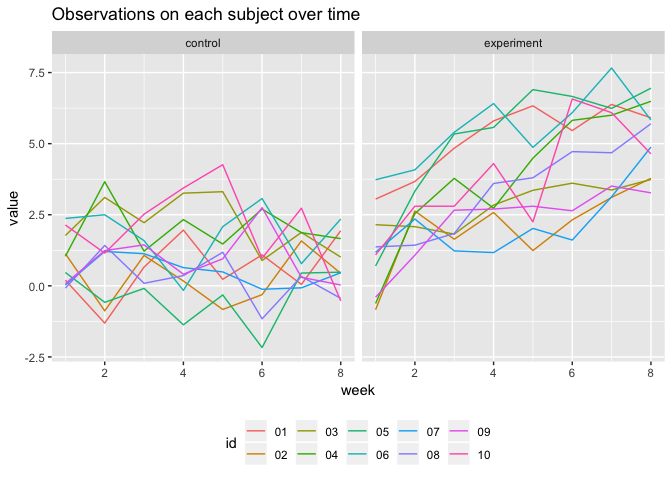

p8105\_hw5\_xz2809
================
Coco
11/1/2018

Problem 1
=========

load files
----------

Here is the **code chunk** to load files:

``` r
files_df = list.files(path = "./data") %>% 
  as.data.frame() 
files_df = files_df[-c(21),] %>% 
  as.data.frame()
colnames(files_df) = "subject_id"
```

bind data
---------

Here is the **code chunk** to iterate over files names and read in data for each subject. The result is saved in the data frame "mydf".

``` r
read_files = function(x){
    read_csv(paste0("./data/",x))
}

df = map(files_df[ ,1],read_files)

mydf = df[[1]]
for (i in 2:20) {
  mydf = rbind(mydf,df[[i]])
}

mydf <- cbind(files_df, mydf) 
```

tidy
----

Here is the **code chunk** to tidy the result and manipulate file names, including control arm and subject ID.

``` r
mydf = mydf %>% 
  gather(key = week, value = value, week_1:week_8) %>% 
  mutate(week = str_replace(week,"week_",""),
         subject_id = str_replace(subject_id,".csv",""),
         overall_id = factor(subject_id)) %>% 
  separate(subject_id, into = c("arms", "id"),sep = "_") %>% 
  mutate(arms = str_replace(arms,"con","control"),
         arms = str_replace(arms,"exp","experiment"))
```

Here is the **code chunk** to make a spaghetti plot showing observations on each subject over time, and comment on differences between groups.

``` r
mydf %>% 
  ggplot(aes(x = as.numeric(week), y=as.numeric(value)))+
  facet_grid(~ as.factor(arms)) + 
  viridis::scale_fill_viridis(discrete = TRUE)+
  geom_line(aes(color = id))+
  theme(legend.position = "bottom")+
  labs(
    x = "week",
    y = "value"
  )+
  ggtitle("Observations on each subject over time")
```



As we can see from above, the value of control groups floats but overall stay constant, while the value of the experimental increases with repect in weeks.

Problem 2
---------

Here is the **code chunk** to load the data. Then we create a city\_state variable and summarize within cities to obtain the total number of homicides and the number of unsolved homicides.

``` r
homiside_df = read_csv("./data/homicide-data.csv") %>% 
  mutate(city_state = paste(city,state,sep=", ")) 

number_homicides = homiside_df %>%
  group_by(city) %>% 
  summarize(total = n()) 

unsolved = homiside_df %>% 
  filter(disposition == "Closed without arrest"  | disposition == "Open/No arrest") %>% 
  group_by(city) %>% 
  summarize(unsolved = n()) %>% 
  rename(cities = city)

number_homicides = cbind(number_homicides,unsolved) %>% 
  select(-cities)
```

The raw data set contains in total 52179 observations and 13 variables. Each observation represents a case, containing an identification ID, reported date, information about the victim, crime location and disposition status. The total number of homicides and the number of unsolved homicides are shown below.

``` r
number_homicides %>% 
  knitr::kable(digits = 2)
```

| city           |  total|  unsolved|
|:---------------|------:|---------:|
| Albuquerque    |    378|       146|
| Atlanta        |    973|       373|
| Baltimore      |   2827|      1825|
| Baton Rouge    |    424|       196|
| Birmingham     |    800|       347|
| Boston         |    614|       310|
| Buffalo        |    521|       319|
| Charlotte      |    687|       206|
| Chicago        |   5535|      4073|
| Cincinnati     |    694|       309|
| Columbus       |   1084|       575|
| Dallas         |   1567|       754|
| Denver         |    312|       169|
| Detroit        |   2519|      1482|
| Durham         |    276|       101|
| Fort Worth     |    549|       255|
| Fresno         |    487|       169|
| Houston        |   2942|      1493|
| Indianapolis   |   1322|       594|
| Jacksonville   |   1168|       597|
| Kansas City    |   1190|       486|
| Las Vegas      |   1381|       572|
| Long Beach     |    378|       156|
| Los Angeles    |   2257|      1106|
| Louisville     |    576|       261|
| Memphis        |   1514|       483|
| Miami          |    744|       450|
| Milwaukee      |   1115|       403|
| Minneapolis    |    366|       187|
| Nashville      |    767|       278|
| New Orleans    |   1434|       930|
| New York       |    627|       243|
| Oakland        |    947|       508|
| Oklahoma City  |    672|       326|
| Omaha          |    409|       169|
| Philadelphia   |   3037|      1360|
| Phoenix        |    914|       504|
| Pittsburgh     |    631|       337|
| Richmond       |    429|       113|
| Sacramento     |    376|       139|
| San Antonio    |    833|       357|
| San Bernardino |    275|       170|
| San Diego      |    461|       175|
| San Francisco  |    663|       336|
| Savannah       |    246|       115|
| St. Louis      |   1677|       905|
| Stockton       |    444|       266|
| Tampa          |    208|        95|
| Tulsa          |    584|       193|
| Washington     |   1345|       589|

For the city of Baltimore, MD, here is the **code chunk** to use the prop.test function to estimate the proportion of homicides that are unsolved.

``` r
num_total_ba = subset(number_homicides,city=="Baltimore")$total
num_unsolved_ba = subset(number_homicides,city=="Baltimore")$unsolved

result_ba = prop.test(num_unsolved_ba,num_total_ba) %>% 
  broom::tidy() %>% 
  janitor::clean_names() %>% 
  select(estimate,conf_low,conf_high) 

result_ba %>% 
  knitr::kable(digits = 2)
```

|  estimate|  conf\_low|  conf\_high|
|---------:|----------:|-----------:|
|      0.65|       0.63|        0.66|

Here is the **code chunk** to use prop.test for each of the cities in your dataset, and extract both the proportion of unsolved homicides and the confidence interval for each. Then we list columns and unnest as necessary to create a tidy dataframe with estimated proportions and CIs for each city. The result data frame is shown below

``` r
test = function(x) {
    prop.test(getElement(x,"unsolved"), getElement(x,"total")) %>% 
    broom::tidy() %>% 
    janitor::clean_names() %>% 
    select(estimate,conf_low,conf_high)
}

homicides_nest <- nest(number_homicides, total:unsolved)

homicides_nest <- homicides_nest %>% 
  mutate(models = map(data,test)) %>% 
  unnest()

homicides_nest %>% 
  knitr::kable(digits = 2)
```

| city           |  total|  unsolved|  estimate|  conf\_low|  conf\_high|
|:---------------|------:|---------:|---------:|----------:|-----------:|
| Albuquerque    |    378|       146|      0.39|       0.34|        0.44|
| Atlanta        |    973|       373|      0.38|       0.35|        0.41|
| Baltimore      |   2827|      1825|      0.65|       0.63|        0.66|
| Baton Rouge    |    424|       196|      0.46|       0.41|        0.51|
| Birmingham     |    800|       347|      0.43|       0.40|        0.47|
| Boston         |    614|       310|      0.50|       0.46|        0.55|
| Buffalo        |    521|       319|      0.61|       0.57|        0.65|
| Charlotte      |    687|       206|      0.30|       0.27|        0.34|
| Chicago        |   5535|      4073|      0.74|       0.72|        0.75|
| Cincinnati     |    694|       309|      0.45|       0.41|        0.48|
| Columbus       |   1084|       575|      0.53|       0.50|        0.56|
| Dallas         |   1567|       754|      0.48|       0.46|        0.51|
| Denver         |    312|       169|      0.54|       0.48|        0.60|
| Detroit        |   2519|      1482|      0.59|       0.57|        0.61|
| Durham         |    276|       101|      0.37|       0.31|        0.43|
| Fort Worth     |    549|       255|      0.46|       0.42|        0.51|
| Fresno         |    487|       169|      0.35|       0.31|        0.39|
| Houston        |   2942|      1493|      0.51|       0.49|        0.53|
| Indianapolis   |   1322|       594|      0.45|       0.42|        0.48|
| Jacksonville   |   1168|       597|      0.51|       0.48|        0.54|
| Kansas City    |   1190|       486|      0.41|       0.38|        0.44|
| Las Vegas      |   1381|       572|      0.41|       0.39|        0.44|
| Long Beach     |    378|       156|      0.41|       0.36|        0.46|
| Los Angeles    |   2257|      1106|      0.49|       0.47|        0.51|
| Louisville     |    576|       261|      0.45|       0.41|        0.49|
| Memphis        |   1514|       483|      0.32|       0.30|        0.34|
| Miami          |    744|       450|      0.60|       0.57|        0.64|
| Milwaukee      |   1115|       403|      0.36|       0.33|        0.39|
| Minneapolis    |    366|       187|      0.51|       0.46|        0.56|
| Nashville      |    767|       278|      0.36|       0.33|        0.40|
| New Orleans    |   1434|       930|      0.65|       0.62|        0.67|
| New York       |    627|       243|      0.39|       0.35|        0.43|
| Oakland        |    947|       508|      0.54|       0.50|        0.57|
| Oklahoma City  |    672|       326|      0.49|       0.45|        0.52|
| Omaha          |    409|       169|      0.41|       0.37|        0.46|
| Philadelphia   |   3037|      1360|      0.45|       0.43|        0.47|
| Phoenix        |    914|       504|      0.55|       0.52|        0.58|
| Pittsburgh     |    631|       337|      0.53|       0.49|        0.57|
| Richmond       |    429|       113|      0.26|       0.22|        0.31|
| Sacramento     |    376|       139|      0.37|       0.32|        0.42|
| San Antonio    |    833|       357|      0.43|       0.39|        0.46|
| San Bernardino |    275|       170|      0.62|       0.56|        0.68|
| San Diego      |    461|       175|      0.38|       0.34|        0.43|
| San Francisco  |    663|       336|      0.51|       0.47|        0.55|
| Savannah       |    246|       115|      0.47|       0.40|        0.53|
| St. Louis      |   1677|       905|      0.54|       0.52|        0.56|
| Stockton       |    444|       266|      0.60|       0.55|        0.64|
| Tampa          |    208|        95|      0.46|       0.39|        0.53|
| Tulsa          |    584|       193|      0.33|       0.29|        0.37|
| Washington     |   1345|       589|      0.44|       0.41|        0.46|

Here is the **code chunk** to create a plot that shows the estimates and CIs for each city with the order according to the proportion of unsolved homicides.

``` r
homicides_nest = homicides_nest[order(homicides_nest$estimate),]


homicides_nest %>% 
ggplot()+
  geom_point(aes(reorder(city,estimate), y = estimate))+
  geom_errorbar(aes(x=city, ymin = conf_low, ymax = conf_high))+
  theme(axis.text.x = element_text(angle = 90, hjust = 1))+
  labs(
    title = "Cities vs Proportion of unsolved cases",
    x = "Cities",
    y = "Proportion of unsolved cases with 95% CI"
  )
```


